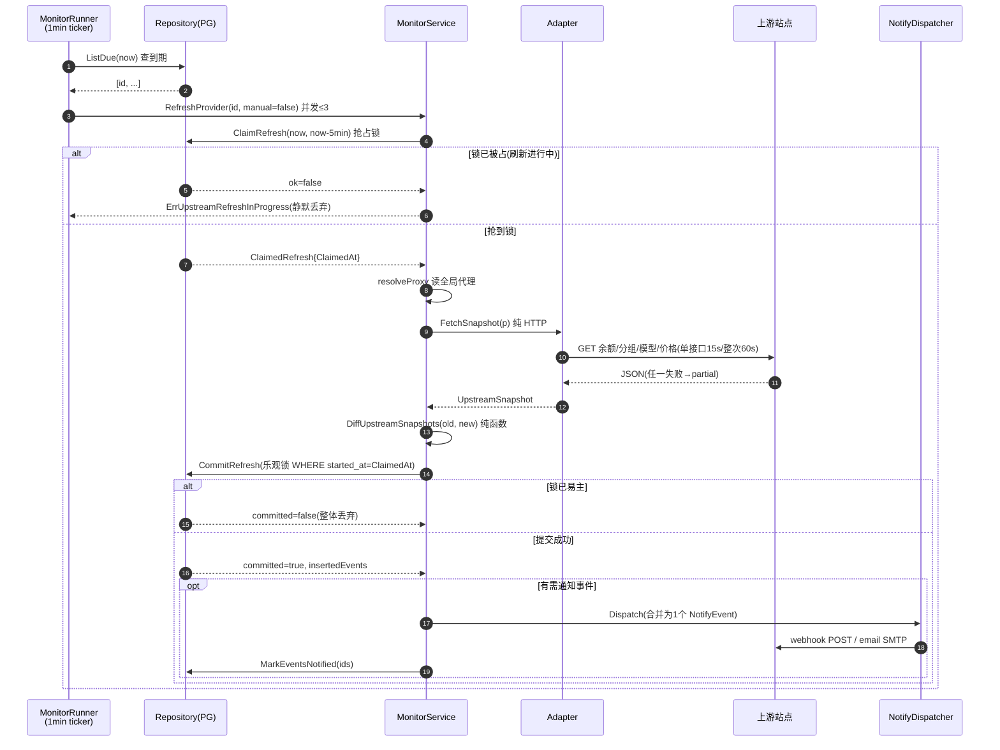
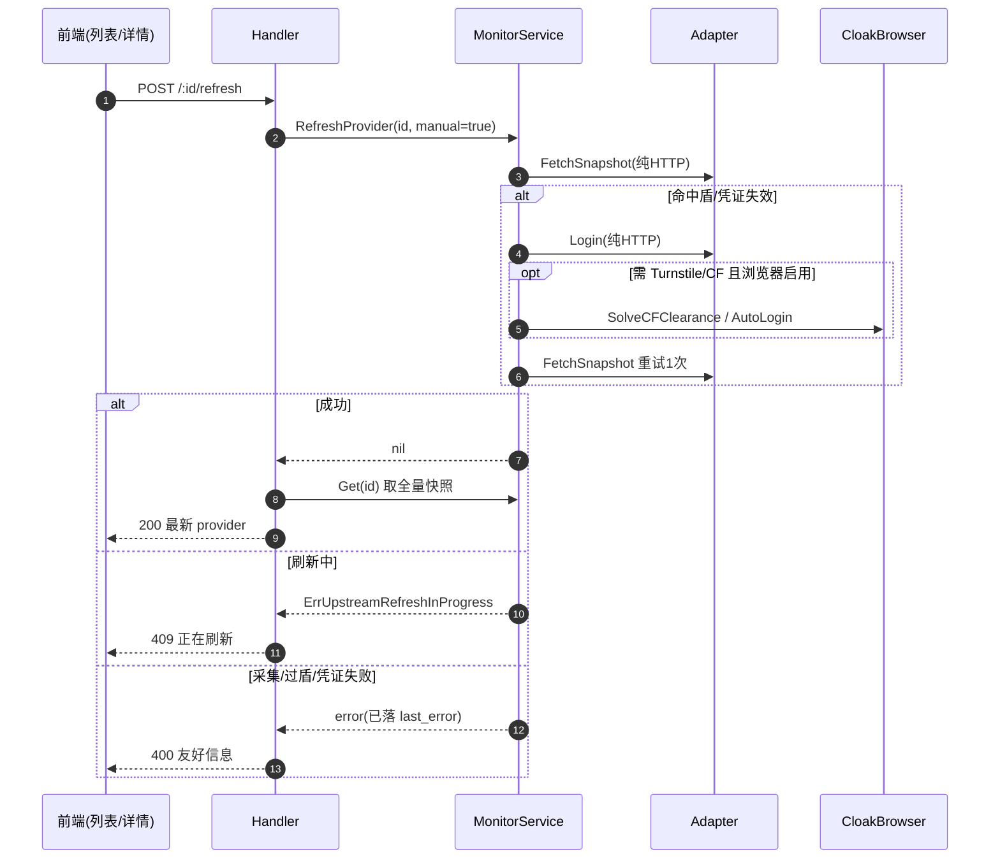
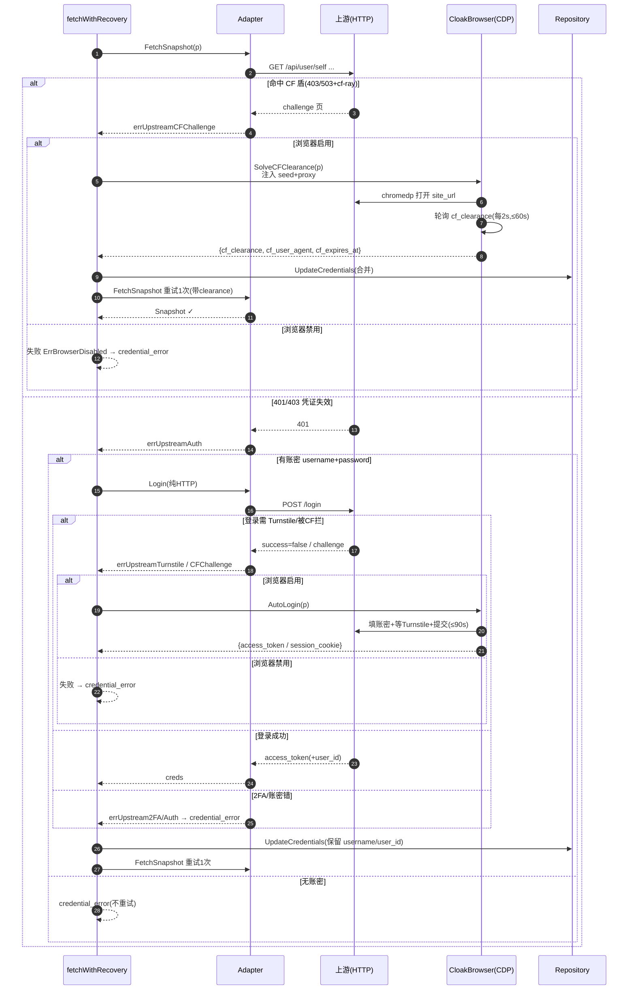
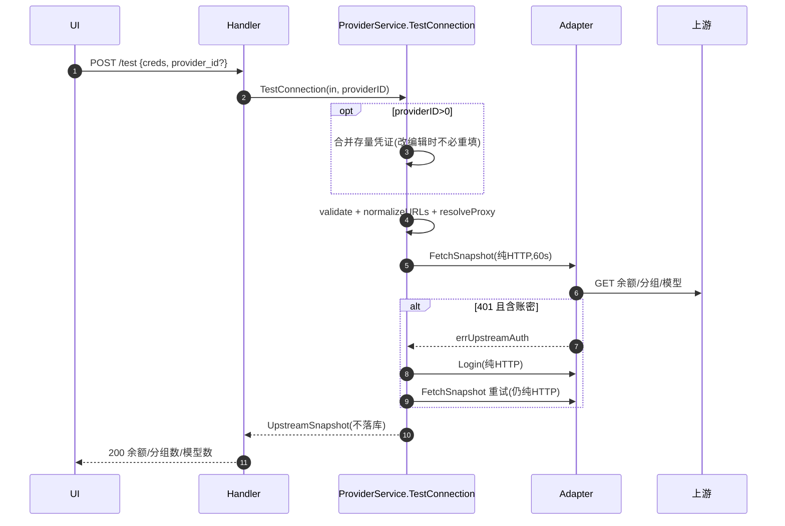
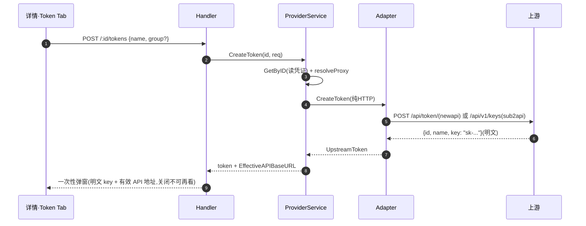
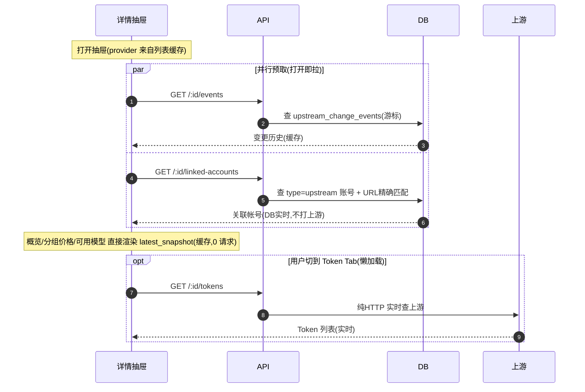
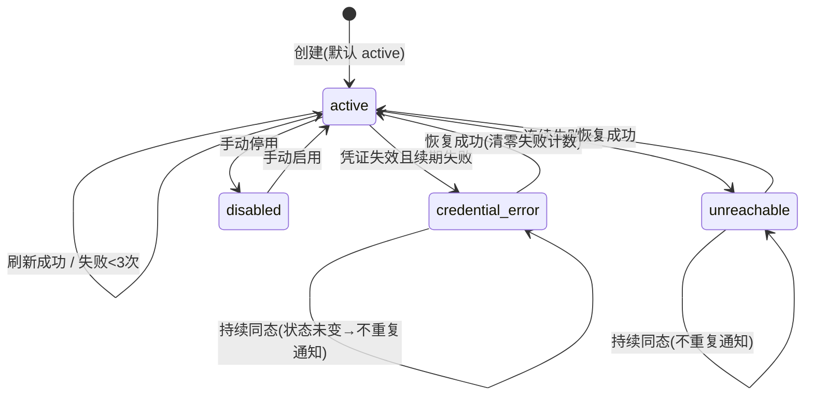
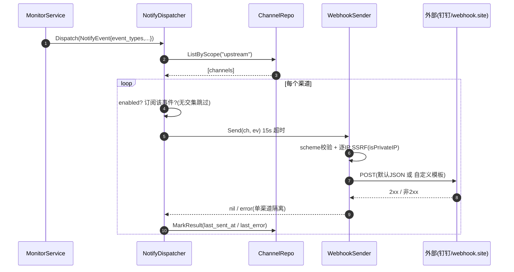
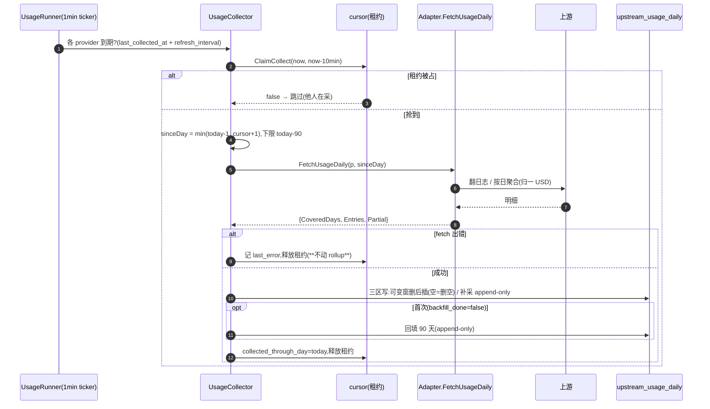
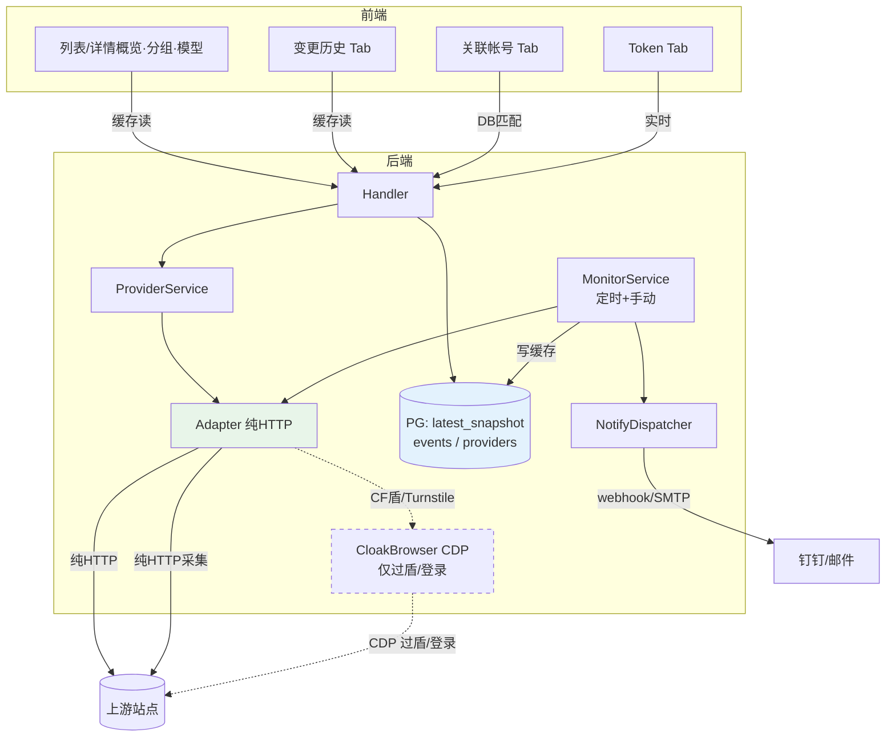

# 实现原理与时序图

> 本文回答四个核心问题:**①哪些功能用 CloakBrowser、哪些是纯 HTTP 协议调用;②哪些数据实时获取、哪些缓存;③每个功能点的实现步骤;④关键链路的时序图。**
> 配合 [架构设计.md](架构设计.md)(数据模型/责任分配)与 [API参考.md](API参考.md)(端点契约)阅读。

---

## 一、一句话原理

**采集以纯 HTTP 为主干,CloakBrowser 仅在「命中 Cloudflare 盾」或「登录需 Turnstile」时按需介入;采集结果落库成快照(`latest_snapshot`),前端读快照=缓存,Token 操作=实时打上游。**

数据有三条获取通路,优先级从左到右:

```
纯 HTTP 采集(主干,~95% 场景)
   └─ 失败分类 errUpstreamCFChallenge / errUpstreamTurnstile
        └─ CloakBrowser 过盾/自动登录(兜底,可选,未配置则降级人工)
缓存读取(DB latest_snapshot / events / accounts)── 前端列表与详情的绝大部分
```

---

## 二、三条数据通路分类总表

| 功能点 | 通路 | 实时/缓存 | 触发方 | 关键代码 |
|--------|------|-----------|--------|----------|
| **余额采集** | 纯 HTTP | 缓存(写 `latest_snapshot`) | 定时 runner / 手动刷新 | `*_adapter_*.go FetchSnapshot` |
| **分组+倍率采集** | 纯 HTTP | 缓存 | 同上 | 同上 |
| **可用模型采集** | 纯 HTTP | 缓存 | 同上 | 同上 |
| **模型价格采集** | 纯 HTTP | 缓存 | 同上 | 同上 |
| **消耗采集(FetchUsageDaily)** | 纯 HTTP | 缓存(写 `upstream_usage_daily` rollup) | 采集 runner / 手动刷新后 | `upstream_usage_{newapi,sub2api}.go` |
| **消耗统计/明细(summary/breakdown)** | **DB 读** | 缓存(读时 ¥ 换算) | 列表/详情 / `usage` 端点 | `upstream_usage_service.go` |
| **账密登录续期(Login)** | 纯 HTTP | 实时(回写凭证) | 401 续期 / 测试连接 | `Login()` |
| **CF 过盾(SolveCFClearance)** | **CloakBrowser(CDP)** | 实时(回写 `cf_clearance`) | HTTP 命中 CF 盾 | `upstream_browser.go` |
| **浏览器自动登录(AutoLogin)** | **CloakBrowser(CDP)** | 实时(回写登录态) | Login 需 Turnstile/CF | `upstream_browser.go` |
| **Token 列表** | 纯 HTTP | **实时**(每次打上游) | 详情 Token Tab | `ListTokens()` |
| **创建 Token** | 纯 HTTP | **实时** | 详情 Token Tab | `CreateToken()` |
| **列表/详情(余额/分组/模型)** | **DB 读** | **缓存** | 前端列表/抽屉 | `List()/Get()` 读 `latest_snapshot` |
| **变更历史** | **DB 读** | 缓存(游标分页) | 详情 变更历史 Tab | `events` 表 |
| **关联帐号** | **DB 读 + 纯计算** | DB 实时(不打上游) | 详情 关联帐号 Tab | `upstream_url_match.go` |
| **诊断截图** | **本地磁盘读** | — | 概览页查看链接 | `<DataDir>/upstream-diagnostics/` |
| **邮件通知** | SMTP | 实时 | 告警事件 | `notify_sender_email.go` |
| **Webhook 通知** | 纯 HTTP(SSRF 防护) | 实时 | 告警事件 | `notify_sender_webhook.go` |

> **结论速记**:
> - **只有两件事用 CloakBrowser**:`SolveCFClearance`(过盾)、`AutoLogin`(浏览器登录)。其余全是纯 HTTP / DB / SMTP。
> - **只有 Token 两个端点是「打上游的实时」**。余额/分组/模型/价格全部走缓存快照,靠后台刷新更新。
> - **关联帐号、变更历史虽是「实时查询」,但查的是本地 DB,不接触上游。**

---

## 三、CloakBrowser:什么时候、怎么介入

### 3.1 介入条件(两个,缺一不可)

1. **已启用**:「采集设置」填了 `browser_cdp_url`(如 `ws://127.0.0.1:9222`)。`BrowserSolver.Enabled()` 据此判断;留空 → 所有浏览器操作返回 `ErrBrowserDisabled`,刷新走人工兜底。
2. **HTTP 通路先失败并被分类为盾**:
   - `FetchSnapshot` 收到 `errUpstreamCFChallenge`(`upstream_http.go isCFChallenge`:403/503 + `cf-mitigated=challenge` 或 `cf-ray`+challenge 关键词) → 触发 `SolveCFClearance`。
   - `Login`(纯 HTTP)收到 `errUpstreamTurnstile` 或 `errUpstreamCFChallenge` → 触发 `AutoLogin`。

> CloakBrowser **永不主动跑**。它是 HTTP 失败后的恢复手段,且每次刷新最多重试 1 次。

### 3.2 两个浏览器操作

| 操作 | 做什么 | 超时 | 产物(合并进凭证) |
|------|--------|------|--------------------|
| `SolveCFClearance` | chromedp 经 CDP 打开 `site_url`,轮询等 `cf_clearance` cookie(每 2s) | 60s | `cf_clearance` / `cf_user_agent`(与 clearance 配套)/ `cf_expires_at`(保守 30min 提示) |
| `AutoLogin` | 打开 `/login` → 填账密 → 等 Turnstile widget 完成 → 提交 → 提取登录态 | 90s | sub2api:`access_token`(读 localStorage `auth_token`);newapi:`session_cookie`(读 session cookie) |

### 3.3 指纹与代理注入(`cdpURLFor`)

每个 provider 向 CDP URL 注入两个 query 参数(CloakBrowser `cloakserve` per-connection 约定):

```
ws://127.0.0.1:9222?fingerprint-seed=upstream-<providerID>&proxy=<规范化全局代理>
```

- `fingerprint-seed=upstream-<id>`:每 provider 指纹稳定(站点眼中身份不抖动)。
- `proxy=`:取「采集设置」**全局代理**(非 per-provider),经 `browserProxyScheme` 统一为 `socks5://`(Chromium 不识别 `socks5h`),`url.QueryEscape` 转义。过盾依赖干净出口 IP,故复用同一代理。

### 3.4 失败诊断截图

任一浏览器步骤失败 → `failWithScreenshot` 截图存 `<DataDir>/upstream-diagnostics/<id>/<时间戳>.png`,每 provider 滚动保留最新 **5** 张。错误信息**只含文件名**(不含凭证/页面内容);文件名严格 `^[0-9]{14}\.png$` 防路径穿越。前端从 `last_error` 正则提取文件名,经 **blob 鉴权请求**(非直链)打开。

---

## 四、纯 HTTP 采集:接口口径

两种上游归一化为同一 `domain.UpstreamSnapshot`。任一子接口失败 → 对应字段缺失 + `Partial=true`,**不整体报错**(diff 时跳过缺失部分,避免误报"全部移除")。

### 4.1 new-api 适配器(`upstream_adapter_newapi.go`)

| 顺序 | 接口 | 用途 | 失败处理 |
|------|------|------|----------|
| 1 | `GET /api/status` | `quota_per_unit`(余额换算分母) | 回退 500000 + partial |
| 2 | `GET /api/user/self` | 余额=`quota ÷ quota_per_unit`、用户 | **认证失败上抛**(续期依赖) |
| 3 | `GET /api/user/models` | 用户可用模型 | partial |
| 4 | `GET /api/pricing` | 模型价格 + `enable_groups` + `group_ratio` | partial |

- 认证头:`Authorization: Bearer <access_token>` + `New-Api-User: <user_id>`。
- 分组模型口径:用户可用模型 ∩ 分组 `enable_groups`(用户模型列表缺失时不做交集)。
- **账密续期**:`POST /api/user/login` 拿 session → `GET /api/user/token` 换 access token;**该 token 接口即便有 session 也要求 `New-Api-User: <userID>` 头**(部分 fork 缺失即 401)。

### 4.2 sub2api 适配器(`upstream_adapter_sub2api.go`,对接本软件自身 API)

| 顺序 | 接口 | 用途 | 失败处理 |
|------|------|------|----------|
| 1 | `GET /api/v1/user/profile` | `{id,username,balance}` | **认证失败上抛** |
| 2 | `GET /api/v1/groups/available` | `[{name,rate_multiplier,description}]` | partial |
| 3 | `GET /api/v1/model-plaza` | `{enabled, models:[{name,groups}]}` 倒排成分组→模型 | `enabled=false`→partial |

- 认证头:`Authorization: Bearer <access_token>`。
- 登录:`POST /api/v1/auth/login {email,password}` → `data.access_token`;`requires_2fa=true` → `errUpstream2FA`(拒绝,需改用 access_token 凭证)。JWT `exp` 解析为 `token_expires_at`(不验签)。

### 4.3 共用 HTTP 层(`upstream_http.go`)

每 provider 构造 client:代理(`proxyurl.Parse` 校验 + `socks5→socks5h` 防 DNS 泄漏,`socks://` 当 `socks5://`)+ `cf_clearance` cookie + 配套 `cf_user_agent` + 超时(单接口 **15s** / 整次快照 **60s**)。**错误分类**驱动续期/过盾:

```
403/503 + CF 特征 → errUpstreamCFChallenge  (→ 过盾)
401/403 其他      → errUpstreamAuth          (→ 续期)
非 2xx            → 仅含状态码错误(不含响应原文,防泄漏)
```

### 4.4 消耗采集接口(fork 新增,`upstream_usage_{newapi,sub2api}.go`)

`FetchUsageDaily(p, sinceDay) → UpstreamUsageResult{CoveredDays, Entries, Partial, Reason}`:适配器内归一到 USD + 按日×维度聚合;**`CoveredDays` 与 `Entries` 解耦**(查到但当天空=应归零 ≠ 查询失败=应保留)。

| 上游 | 接口 | 口径 |
|---|---|---|
| newapi | `GET /api/log/self?type=0&start_timestamp=&p=&page_size=100`(翻页,上限 200 页) | 留 `type∈{2 消费,6 退款}`;`cost=±quota/quota_per_unit`;出 `key`(token_id)/`group`(名)/`model`/`total` |
| sub2api | `GET /api/v1/keys` → 每密钥 `GET /api/v1/user/api-keys/:id/usage/daily?days=N`(N≤90) | `cost=actual_cost`;出 `key`(api_key_id)+`total`;**无 group** |

> 退款缺 token_id/group 只入 total;`quota_per_unit` 探测失败回退 50 万并标 partial。详见 [架构设计 §八](架构设计.md)。

---

## 五、实时 vs 缓存:数据新鲜度模型

```
┌──────────── 写缓存(后台) ────────────┐         ┌──── 读缓存(前端) ────┐
                                                   
 MonitorRunner ticker(每 1min)                     GET /upstream-providers
   → ListDue(到期:间隔默认 60min)         写         (List,瘦身快照)
   → RefreshProvider(并发≤3)        ───→  latest_  ───→  GET /:id
   → FetchSnapshot(纯HTTP±过盾)            snapshot       (Get,全量快照)
   → CommitRefresh(事务落库)               (PG)
```

- **余额 / 分组 / 倍率 / 模型 / 价格** = 缓存。读列表/详情时**不打上游**,直接渲染 DB 里的 `latest_snapshot`。更新靠:① 后台定时刷新(`refresh_interval_minutes`,默认 60);② 用户点「刷新」手动触发。
- **手动刷新 `POST /:id/refresh`** = 同步实时采集(最坏 ~70s:60s 快照 + 浏览器过盾),成功后立即返回最新全量快照。
- **Token 列表/创建** = 每次实时打上游(不缓存),因 Token 是写操作/敏感即时数据。
- **关联帐号 / 变更历史** = 实时查**本地 DB**(关联帐号还要做 URL 精确匹配纯计算),不接触上游。

### 列表 vs 详情的快照差异(瘦身)

| 端点 | 快照内容 | 原因 |
|------|----------|------|
| `GET /upstream-providers`(列表) | 瘦身:保留 `groups`(含 models 供前端算模型数),**去掉** `model_pricing` 与 `user_info` | 价格表巨大,列表不需要 |
| `GET /:id`(详情) | 全量(含 `model_pricing`) | 详情分组价格 Tab 需要 |

---

## 六、功能点实现步骤 + 时序图

### 6.1 定时刷新(核心编排,`upstream_monitor.go`)

**通路**:纯 HTTP 采集为主,按需 CloakBrowser。**结果**:写缓存。

**步骤**:
1. `UpstreamMonitorRunner` 每 1min ticker → `ListDue(now)` 查到期 provider(`status≠disabled` 且 `last_refreshed_at + interval ≤ now`)。
2. 并发度 3,每个 → `RefreshProvider(id, manual=false)`。
3. `ClaimRefresh`:条件 UPDATE 抢占锁(`refresh_started_at` 非空且未 stale 则失败)→ 多实例靠 DB 锁互斥,无 leader 选举。
4. `resolveProxy`:从「采集设置」读全局 `upstream_proxy_url` 进 `p.ProxyURL`。
5. `fetchWithRecovery`:采集(401 续期 / CF 过盾,最多重试 1 次,见 6.3)。
6. 成功 → `DiffUpstreamSnapshots`(纯函数 diff)→ `CommitRefresh`(乐观锁事务)→ `notifyEvents`(合并通知)。
7. 失败 → `commitFailure`(失败计数 + 状态机 + 按矩阵生成事件)。



---

### 6.2 手动刷新 / 重新登录

**通路 / 实时性**:同 6.1,但**同步执行**并直接返回结果。

- `POST /:id/refresh` → `RefreshProvider(id, manual=true)`(绕过 disabled 拒绝)。
  - 成功 → 200 + 最新全量快照;刷新中 → **409**;采集/过盾/凭证失败 → **400** + 友好信息(`last_error` 已持久化,详情可见);不存在 → 404。
- `POST /:id/relogin` → `ResetTokens`(剥离 `access_token`/`cf_*`/`token_expires_at` 5 键)→ 复用 `Refresh`,强制走自动登录/过盾路径。



---

### 6.3 凭证生命周期:401 续期 + CF 过盾(`fetchWithRecovery`)

**这是 CloakBrowser 唯一的入口。** 最多重试 1 次。

**分支**:
- `errUpstreamCFChallenge` → 浏览器启用? `SolveCFClearance` → 合并 `cf_clearance` → 回写 → 重试;未启用 → 失败(`ErrBrowserDisabled`)。
- `errUpstreamAuth` → 有账密? `Login`(纯 HTTP):
  - 成功 → 合并 token → 回写 → 重试。
  - 需 Turnstile/CF → 浏览器启用? `AutoLogin` → 重试;未启用 → 失败。
  - 2FA / 账密错 → `credential_error`(不重试)。
  - 无账密 → `credential_error`。
- 其他错误 → 透传。

> 回写用 `MergeUpstreamCredentials`:**保留 `username`/`user_id` 身份键**——续期产物只含 `{access_token,user_id}` 等,绝不含 username;若按旧语义合并会抹掉 username 导致**永久 credential_error**(此为 commit `7edebfd6` 修复点)。



---

### 6.4 测试连接(创建/编辑前,不落库)

**通路**:纯 HTTP(含 Login 重试)。**注意:不走 CloakBrowser,不持久化。** 仅账密无 token 时 401 自动 Login 一次再采集。



---

### 6.5 快速创建 Token(实时打上游)

**通路**:纯 HTTP。**实时**:每次创建/列表都打上游,key 明文仅本次返回。



> newapi 创建参数:`unlimited_quota=true`、`expired_time=-1`(永不过期),可带 `group`。

---

### 6.6 详情抽屉加载(实时/缓存混合,前端视角)

打开抽屉时 `provider` 来自列表缓存;6 Tab 数据来源不同:

| Tab | 来源 | 实时/缓存 | 何时加载 |
|-----|------|-----------|----------|
| 概览 | `latest_snapshot`(余额/用户/有效API地址/last_error+截图) | 缓存 | 直接渲染 |
| 分组价格 | `latest_snapshot.groups` | 缓存 | 直接渲染 |
| 可用模型 | `latest_snapshot.groups[].models` | 缓存 | 直接渲染 |
| Token | `GET /:id/tokens` | **实时打上游** | 切到该 Tab **懒加载** |
| 关联帐号 | `GET /:id/linked-accounts` | DB 实时(不打上游) | 打开抽屉**并行预取** |
| 变更历史 | `GET /:id/events` | 缓存(DB 游标分页) | 打开抽屉**并行预取**(概览近7天高亮依赖) |



---

### 6.7 余额告警 diff + 状态机

**通路**:纯函数 + DB。`DiffUpstreamSnapshots`(`upstream_snapshot_diff.go`)无 IO。

**余额跨越式检测**(首次快照也执行):
- `bal < th && !alerted` → `balance_low` 事件 + 置 `BalanceAlerted=true`(**需通知**)。
- `bal >= th && alerted` → `balance_recovered` 事件 + 复位(**仅记录不通知**)。

**变更类**(需 old/new 双方有数据,partial 缺失跳过):分组倍率变化→`price_changed`;模型增删→`model_added`/`model_removed`;分组增删→`group_added`/`group_removed`;模型价格按键深度 JSON 比较(键序无关)→`price_changed`。是否通知由 `notify_on_price_change` 决定。

**状态机**(`commitFailure` / `commitSuccess`):



- **跨入失败态才通知 1 次**(状态未变不重复)→ 杜绝告警轰炸。
- 一次刷新的多条需通知变更**合并为一个 `NotifyEvent`**。

---

### 6.8 通知派发(`notify_dispatcher.go`)

**通路**:Webhook=纯 HTTP(SSRF 防护);Email=SMTP。**实时**:事件提交后同步派发。

**步骤**:
1. `Dispatch` 按 `scope=upstream` 列渠道,逐个过滤:`enabled` + 订阅事件(`events` 空=全部,有交集即发)。
2. 每渠道 15s 超时,**单渠道失败隔离**(仅记 `last_error`+日志,不影响其他渠道与主流程)。
3. Webhook SSRF 防护:scheme 仅 http/https;`DialContext` 逐 resolved-IP 用 `isPrivateIP` 校验(防 DNS rebinding);禁止重定向;响应体 64KB 上限;私网默认拒绝(可在采集设置放开)。支持 Go `text/template` 自定义 body(`{{.Title}}`/`{{join .Items}}`/`{{json .X}}`)。



---

### 6.9 关联帐号(DB + 纯计算,不打上游)

**通路**:DB 读 + URL 精确匹配。**完全不接触上游。**

`LinkedAccounts` 取本系统 `type=upstream` 账号,用 `UpstreamURLMatches` 把 provider 的**有效 API 地址**与账号 `base_url` 精确匹配:scheme 相等 + host 全等(默认端口归一)+ **路径段边界前缀**——防 `example.com.evil` 后缀攻击与 `/api2` 误配,`path.Clean` 防 `..` 穿越,`net.JoinHostPort` 处理 IPv6。

---

### 6.10 采集设置 + 全局代理

**通路**:DB(`settings` 表)。3 个键:

| 键 | 作用 | 默认 |
|----|------|------|
| `upstream_browser_cdp_url` | CloakBrowser CDP 地址,**空=禁用浏览器过盾** | 空 |
| `upstream_proxy_url` | **全局采集代理**(HTTP 采集与 CloakBrowser 过盾共用) | 空(直连) |
| `upstream_notify_allow_private_webhook` | 是否允许 webhook 指向私网 | false |

代理 URL 防泄:GET 响应 `MaskUpstreamProxyURL` 把密码段脱敏为 `***`;PUT `MergeUpstreamProxyURL`——含 `***` 占位=保留旧值,空串=清除,其余=新值。scheme 规范化:HTTP 采集 `socks://`→`socks5://`→`socks5h`(防 DNS 泄漏);浏览器统一 `socks5`(Chromium 不识别 `socks5h`)。

---

### 6.11 上游消耗采集(fork 新增,`upstream_usage_*.go`)

**通路**:独立后台 runner(纯 HTTP 翻日志/按日聚合)→ 按日 rollup 落库;读取走 DB 缓存 + 读时 ¥ 换算。**与刷新编排并行、租约隔离。**



**幂等三区**(`buildIncrementWrites`):可变窗(最近 2 天)`Replace`(空=删空,纠正退款/归零)、冻结区(已关账旧日)不重查(免被上游清日志误删)、补采区(停机漏日)`FillIfAbsent`。**读**:`SummaryBatch` 四时间窗 SUM + breakdown 按 `scope_key` 聚合取最新名 + `cost_cny = usd ÷ recharge_ratio`(读时换算)。**手动刷新成功后也追加一次采集。**

---

## 七、凭证三层防泄(贯穿全链路)

1. **响应脱敏**(`RedactUpstreamCredentials`):`password`/`access_token`/`cf_clearance`/`cf_user_agent` 从响应剥离,仅返回布尔状态 + token 尾 4 位。
2. **PUT/续期合并**(`MergeUpstreamCredentials`):敏感键 + 身份键(`username`/`user_id`)在 incoming 缺省时保留旧值(前端不回显明文也不误清空;杜绝续期抹掉 username)。代理 URL 同理 `Mask`/`Merge`。
3. **错误/日志/事件**:`last_error` 截断 500 字且**不含响应原文**(HTTP 层保证只给状态码);CF/凭证事件 `detail` 只存错误类别(`category`),不存凭证值;ent `credentials` 标 `Sensitive()` 不进 `String()`。

---

## 八、关键时间常量速查

| 常量 | 值 | 出处 |
|------|----|----|
| 单接口超时 | 15s | `upstreamRequestTimeout` |
| 整次快照超时 | 60s | `upstreamSnapshotTimeout` |
| CF 过盾上限 | 60s | `browserCFTimeout` |
| 浏览器登录上限 | 90s | `browserLoginTimeout` |
| 抢占锁 stale | 5min | `refreshStaleAfter` |
| 定时 ticker | 1min | `monitorTickInterval` |
| 刷新并发度 | 3 | `monitorConcurrency` |
| 连续失败阈值 | 3 → unreachable | `unreachableFailThreshold` |
| 采集租约 stale | 10min | `usageCollectStaleAfter` |
| 采集 ticker | 1min | `usageRunnerTick` |
| 可变窗(重算覆盖) | 2 天 | `usageMutableWindowDays` |
| 回填窗口 | 90 天 | `usageBackfillDays` |
| 日志翻页上限 | 200 页 × 100 条 | `newapiUsageMaxPages`/`newapiUsagePageSize` |
| 默认刷新间隔 | 60min | `RefreshIntervalMinutes` |
| 续期重试上限 | 1 次 | `fetchWithRecovery` |
| 诊断截图保留 | 5 张/provider | `diagnosticsKeep` |
| 通知单渠道超时 | 15s | `notify_dispatcher.go` |
| Webhook 响应上限 | 64KB | `webhookResponseLimit` |
| HTTP 响应读取上限 | 4MB | `upstream_http.go` |

---

## 九、一图总览:数据从哪来到哪去



> 绿色 = 纯 HTTP 主干;虚线框 = CloakBrowser(仅按需);蓝色 = DB 缓存。

---

**最后更新**:2026-06-09 · 与 `backend/internal/service/upstream_*.go` 源码对齐
